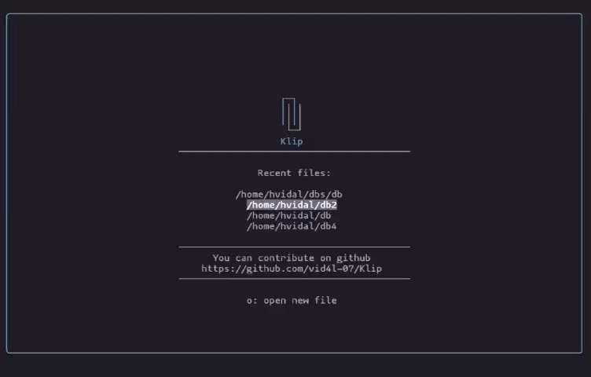

<div align="center">

# Klip

Minimal terminal-based password manager.



[Features](#features) · [Installation](#installation) · [Usage](#usage) · [Security](#security)

</div>

## Features

- Fully **offline** operation.
- **Secure** encryption using ```Argon2id``` for key derivation and authenticated encryption with ```libsodium```.
- Secure password generator.
- Custom TUI built without external libraries.

---

## Installation

### AppImage

Download the AppImage from <a href="https://github.com/vid4l-07/Klip/releases"> releases </a> and run:
```bash
chmod +x klip-x86_64.appimage 
./klip-x86_64.appimage
```

### Build from source

**Dependencies**:
- <a href="https://doc.libsodium.org/installation">libsodium</a>

**Install**:
```bash
git clone https://github.com/vid4l-07/Klip.git
cd klip
mkdir build
cd build
cmake ..
make
sudo make install
```

---

## Usage

### Global

| Key        | Action               |
| -------    | -------------------- |
| ```q```    | quit                 |

### Tab Bar

| Key        | Action               |
| -------    | -------------------- |
| ```l``` / ```Right``` | move right  |
| ```h``` / ```Left```  | move left   |
| ```Enter``` | open selected db      |
| ```o```     | open/create new db  |
| ```x```     | close selected db     |

### Database

| Key                  | Action                  |
| ---------------------| ------------------------|
| ```Esc```            | Focus tab bar           |
| ```j``` / ```Down``` | move down               |
| ```k``` / ```Up```   | move up                 |
| ```Enter```          | select/copy             |
| ```n```              | new credential          |
| ```f```              | filter by site          |
| ```e```              | edit credential         |
| ```d```              | delete credential       |
| ```g```              | generate secure password|


### Copy to clipboard

When a credential is selected:

- ```Enter``` on User copies the username.
- ```Enter``` on Pass copies the password.

### Open file

When you choose Open, a text popup appears. Inside the popup, you can press ```Tab``` to navigate through recently opened databases.

You can enter the absolute path or the relative path to the database. If the file does not exist, it will be created if the specified path is valid.

Recent file paths are stored in ```$HOME/.config/klip/recents```.

---

## Security

All encryption logic is located in ```src/Security.cpp```

### Key derivation

* When creating a database, a master password is requested.
* A cryptographic key is derived from the password and a unique random salt using ```crypto_pwhash``` from **libsodium**, based on **Argon2id** in **INTERACTIVE** mode (adjustable cost parameters against brute-force attacks).

### Encryption

* The database is encrypted using ```crypto_secretbox_easy``` with the derived key and a random nonce.
* This algorithm provides tamper detection through a MAC.

### Storage format

* The encrypted file is stored in binary with the following format:

```
[salt][nonce][ciphertext]
```

### Decryption process

* The key is derived using the password provided by the user and the stored salt.
* The data is decrypted using ```crypto_secretbox_open_easy```.
* If the password is incorrect or the file has been modified, MAC verification fails and the operation is rejected.

---

## Contributions

Contributions are always welcome. If you find a bug or want to help with new features, you can:

- Open an issue in the repository.
- Open a pull request.
- Send me an email at <a href="mailto:h.vidal7@proton.me">h.vidal7@proton.me</a>
